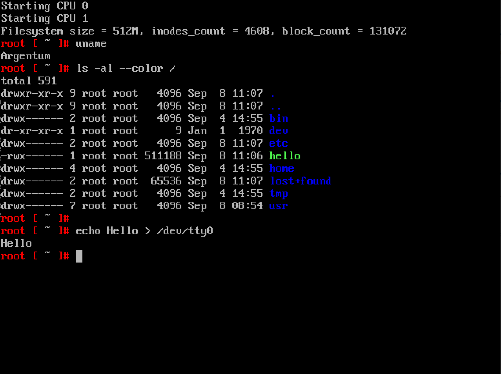

# Argentum

Toy UNIX-like operating system written for ARMv7 and x86.

The project is under active development and currently runs only in the QEMU
emulator. The supported boards are:
- RealView Platform Baseboard Explore for Cortex-A9 (`realview-pbx-a9`)
- Realview Platform Baseboard for Cortex-A8 (`realview-pb-a8`)
- Standard PC (`pc`)



## Building and running the OS

1. Install the necessary headers
   ```
   make install-headers
   ```
2. Build and install the OS-specific toolchain (you will be prompted for the
   superuser password a couple times)
   ```
   make tools-binutils
   make tools-gcc
   ```
3. Build the standard C library
   ```
   make all-lib
   ```
4. Build and install the libstdc++ library
   ```
   make tools-libstdc++-v3
   ```
5. Build the kernel and command-line utils
   ```
   make all
   ```
6. Build desired ported packages (optional)
   ```
   make ports-bash (requires ncurses)
   make ports-binutils
   make ports-coreutils
   make ports-dash
   make ports-diffutils
   make ports-file
   make ports-findutils
   make ports-gawk
   make ports-gcc (requires binutils)
   make ports-grep
   make ports-gzip
   make ports-iana-etc
   make ports-inetutils (requires iana-etc and ncurses)
   make ports-less
   make ports-m4
   make ports-make
   make ports-ncurses
   make ports-sed
   make ports-vim (requires ncurses)
   ```
7. Run the kernel in the emulator (you'll need `qemu-system-arm` or
   `qemu-system-i386`):
   ```
   make qemu
   ```
